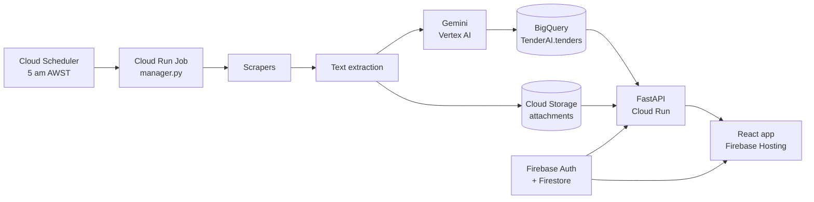
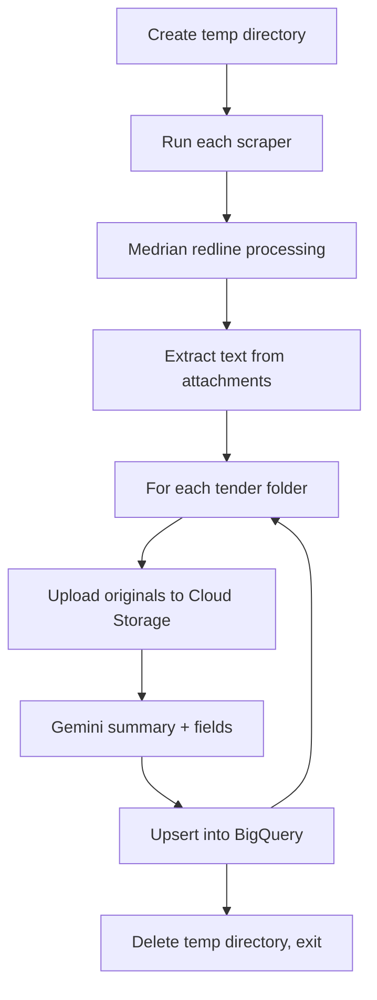
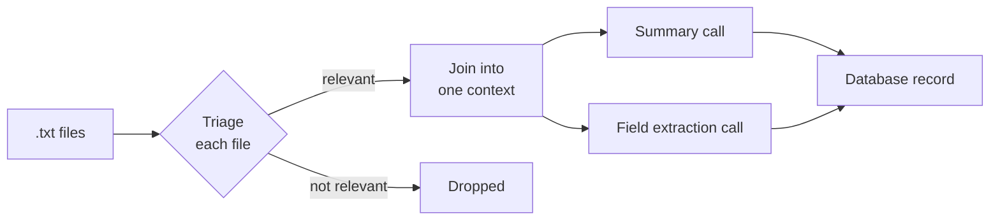
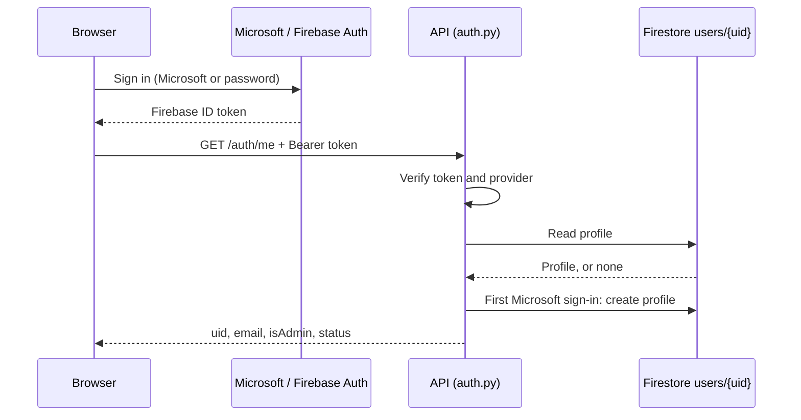

# TenderAI Documentation

UWA CITS3200 Group 57 · Repository: [UtkristaUwa/CITS3200_57](https://github.com/UtkristaUwa/CITS3200_57)

**Client:** Ramon Wenzel, Social Ventures Australia (SVA)

## Team

| Name                     | GitHub           | Main areas                                   |
|--------------------------|------------------|----------------------------------------------|
| Utkrista Sen             | UtkristaUwa, aki | API, Schema, GCP, Firebase, documentation    |
| Sepehr Moghani Pilehroud | sepehrmoghani    | web_scrapers, attachment storage, API, tests |
| Jinghao Hu               | jinghao163       | Frontend, Firestore rules                    |
| Lucan McDonald           | PiesOnTues       | AI processing, Dockerfile                    |
| Benjamin Gilmore         | bgilmore22       | error_scrapers, Cloud Functions, frontend    |
| Radrados                 | Radrados         | Document extraction, GCP                     |

## Contents

- [1. Overview](#1-overview)
- [2. Architecture](#2-architecture)
  - [Tech stack](#tech-stack)
  - [Repository layout](#repository-layout)
- [3. Daily pipeline](#3-daily-pipeline)
  - [Step by step](#step-by-step)
  - [Failure handling](#failure-handling)
- [4. Scrapers](#4-scrapers)
  - [Sources in the pipeline](#sources-in-the-pipeline)
  - [How a scraper works (AusTender)](#how-a-scraper-works-austender)
  - [Differences between sources](#differences-between-sources)
  - [Output folder for one tender](#output-folder-for-one-tender)
  - [Status codes](#status-codes)
  - [When a site breaks, and adding a site](#when-a-site-breaks-and-adding-a-site)
- [5. Document extraction and attachment storage](#5-document-extraction-and-attachment-storage)
  - [Text extraction](#text-extraction)
  - [Attachment storage](#attachment-storage)
- [6. AI processing](#6-ai-processing)
  - [Steps in process_tender()](#steps-in-process_tender)
  - [Relevance scoring (in progress, not merged)](#relevance-scoring-in-progress-not-merged)
  - [The config file](#the-config-file)
- [7. Database](#7-database)
  - [tenders, in short](#tenders-in-short)
  - [How a tender is saved: upsert_tender()](#how-a-tender-is-saved-upsert_tender)
  - [tender_snapshots](#tender_snapshots)
  - [Schema files](#schema-files)
- [8. API](#8-api)
  - [Endpoints](#endpoints)
  - [GET /tenders parameters](#get-tenders-parameters)
  - [Downloads](#downloads)
  - [Other behaviour](#other-behaviour)
- [9. Authentication and users](#9-authentication-and-users)
  - [Sign-in methods](#sign-in-methods)
  - [What the API checks on every request](#what-the-api-checks-on-every-request)
  - [Admins](#admins)
  - [Cloud Functions](#cloud-functions)
  - [Firestore rules](#firestore-rules)
- [10. Frontend](#10-frontend)
  - [Pages](#pages)
  - [Components](#components)
  - [Shared state (contexts)](#shared-state-contexts)
  - [New tender flag](#new-tender-flag)
  - [Route guards](#route-guards)
  - [Talking to the API](#talking-to-the-api)
  - [Loading and error states](#loading-and-error-states)
- [11. Configuration reference](#11-configuration-reference)
  - [Pipeline (manager.py and its stages)](#pipeline-managerpy-and-its-stages)
  - [API](#api)
  - [Frontend](#frontend)
  - [Config files](#config-files)
- [12. Google Cloud and deployment](#12-google-cloud-and-deployment)
  - [Services in use](#services-in-use)
  - [How each part is deployed](#how-each-part-is-deployed)
  - [Access notes](#access-notes)
- [13. Running locally](#13-running-locally)
  - [Frontend (http://localhost:5173)](#frontend-httplocalhost5173)
  - [API (http://localhost:8000, docs at /docs)](#api-httplocalhost8000-docs-at-docs)
  - [Pipeline](#pipeline)
- [14. Testing](#14-testing)

## 1. Overview

TenderAI is a UWA CITS3200 project (Group 57) built for Social Ventures Australia. SVA works across consulting, social impact investing and sector development. Relevant tenders and grants are spread over many government portals, and staff can’t watch them all.

Every morning TenderAI scrapes the portals, reads each tender and its attachments, uses Gemini to summarise and saves it to BigQuery. SVA staff sign in to a web app to to check the tenders, rather then going through 20+ portals they can check TenderAI

**What the brief asks for** ([README](https://github.com/UtkristaUwa/CITS3200_57/blob/main/README.md)): monitor configurable sources, extract key information, remove duplicates, match tenders to SVA’s interest areas, store them centrally, notify staff through Microsoft Teams, explain why a tender matched, collect accept/reject feedback, and give admins a console for sources, profiles and system status.

Client contact at SVA: Ramon.

## 2. Architecture

Two halves share one BigQuery table: a daily batch job writes tenders in, and an API plus web app read them out.

The job runs top to bottom once a day. The web app only ever reads.

### Tech stack

| Layer              | Technology                                                                                                 |
|--------------------|------------------------------------------------------------------------------------------------------------|
| Scraping           | Python, httpx, BeautifulSoup, SeleniumBase (real Chrome for Tenders ACT)                                   |
| Text extraction    | PyMuPDF (PDF), python-docx (Word)                                                                          |
| AI                 | Gemini 2.5 Flash on Vertex AI (google-genai), Pydantic schemas, tenacity retries |
| Database           | BigQuery, dataset `TenderAI`                                                                               |
| File storage       | Cloud Storage bucket `tenderai-dev-documents`                                                              |
| API                | FastAPI on Cloud Run (`tenderai-api`)                                                                      |
| Frontend           | React 19, TypeScript, Vite, Material UI, React Router, Axios                                               |
| Auth and user data | Firebase Auth (Microsoft Entra ID SSO and email/password), Firestore, Firebase Cloud Functions             |
| Hosting and CI     | Firebase Hosting, GitHub Actions, Cloud Build, Artifact Registry                                           |

Everything runs in GCP project `tenderai-dev`, region `australia-southeast1` (Sydney).

### Repository layout

| Path                                                                                                                                                                   | What’s in it                                                                  |
|------------------------------------------------------------------------------------------------------------------------------------------------------------------------|-------------------------------------------------------------------------------|
| [manager.py](https://github.com/UtkristaUwa/CITS3200_57/blob/main/manager.py)                                                                                          | The daily pipeline: runs every stage in order                                 |
| [error_scrapers/](https://github.com/UtkristaUwa/CITS3200_57/tree/main/error_scrapers)                                                                                 | Current scrapers (GrantConnect, buy.nsw, Tenders ACT) and shared status codes |
| [web_scrapers/](https://github.com/UtkristaUwa/CITS3200_57/tree/main/web_scrapers)                                                                                     | Older scrapers; AusTender still runs from here                                |
| [document_scraper/](https://github.com/UtkristaUwa/CITS3200_57/tree/main/document_scraper)                                                                             | Pulls text out of PDF and Word attachments                                    |
| [attachment_store.py](https://github.com/UtkristaUwa/CITS3200_57/blob/main/attachment_store.py)                                                                        | Uploads original attachments to Cloud Storage                                 |
| [processing/](https://github.com/UtkristaUwa/CITS3200_57/tree/main/processing)                                                                                         | Gemini processing and its prompt config file                                  |
| [ingestion/](https://github.com/UtkristaUwa/CITS3200_57/tree/main/ingestion)                                                                                           | BigQuery upsert, dedup and change history                                     |
| [Schema/](https://github.com/UtkristaUwa/CITS3200_57/tree/main/Schema)                                                                                                 | BigQuery table definitions and migrations                                     |
| [api/](https://github.com/UtkristaUwa/CITS3200_57/tree/main/api)                                                                                                       | FastAPI backend                                                               |
| [frontend/](https://github.com/UtkristaUwa/CITS3200_57/tree/main/frontend)                                                                                             | React web app                                                                 |
| [functions/](https://github.com/UtkristaUwa/CITS3200_57/tree/main/functions)                                                                                           | Firebase Cloud Functions: `inviteUser`, `setUserAdmin`                        |
| [firestore.rules](https://github.com/UtkristaUwa/CITS3200_57/blob/main/firestore.rules)                                                                                | Who can write what in Firestore                                               |
| [infra/](https://github.com/UtkristaUwa/CITS3200_57/tree/main/infra)                                                                                                   | GCP setup and schema scripts                                                  |
| [Dockerfile](https://github.com/UtkristaUwa/CITS3200_57/blob/main/Dockerfile), [cloudbuild.yaml](https://github.com/UtkristaUwa/CITS3200_57/blob/main/cloudbuild.yaml) | Pipeline image and its build                                                  |
| [tests/](https://github.com/UtkristaUwa/CITS3200_57/tree/main/tests)                                                                                                   | Python, Firestore rules and Cloud Functions tests                             |
| [docs/SSO_SETUP.md](https://github.com/UtkristaUwa/CITS3200_57/blob/main/docs/SSO_SETUP.md)                                                                            | Microsoft sign-in setup checklist                                             |
| tenders_data/                                                                                                                                                          | Sample scraped tenders committed for testing                                  |

## 3. Daily pipeline

[manager.py](https://github.com/UtkristaUwa/CITS3200_57/blob/main/manager.py) is the only scheduled program. Cloud Scheduler starts the Cloud Run Job `tender-batch-job` at 5 am Perth time, which runs `python manager.py` inside the pipeline image.

### Step by step

1.  **Temporary directory.** Everything is written to a temp folder in the container’s memory. It is deleted when the run ends, so anything worth keeping must be uploaded first.
2.  **Scrapers.** `run_scrapers()` calls each scraper in the `SCRAPERS` list with `limit=SCRAPE_LIMIT` (50 in the Dockerfile) per source: `austender`, `grantconnect`, `buynsw`, `tenders_act`. Each writes one folder per tender. Newer scrapers return `(status_code, tenders)`, listing each folder, its attachments and source URL. For older scrapers that return nothing, the manager compares folders before and after the run to work out which portal they came from.
3.  **Text extraction.** `document_scraper.process_tenders()` writes a `.txt` beside every PDF and Word file. A failure here is logged but not fatal.
4.  **Per tender, attachments.** `attachment_store.upload_tender_attachments()` copies each original to Cloud Storage and deletes the local copy to save memory.
5.  **Per tender, AI.** `process_tender()` sends the text to Gemini and gets back a summary and structured fields. The manager then overrides `source_id` and `source_url` with what the scraper reported, and merges storage details with extracted text into the `documents` list.
6.  **Per tender, database.** `upsert_tender()` inserts the tender, updates it, or just bumps `last_scanned_at` if nothing changed.

### Failure handling

- A scraper that throws, or returns a failure code (1 to 5), is logged and recorded; the others still run. Code 6 (partial) is logged as a warning.
- If no tender folders exist at all, the job exits with code 1.
- A failure in AI processing or the database write skips that one tender and moves on.
- At the end, any scraper failure makes the job exit with code 1, so Cloud Run marks the run failed. It exits with `os._exit` rather than `sys.exit` to avoid a segfault during shutdown cleanup.
- Set `PIPELINE_DEBUG=on` to print each full tender record to the logs.

## 4. Scrapers

Four portals run in the daily pipeline. [error_scrapers/](https://github.com/UtkristaUwa/CITS3200_57/tree/main/error_scrapers) (Ben’s) is the current design with proper status codes. [web_scrapers/](https://github.com/UtkristaUwa/CITS3200_57/tree/main/web_scrapers) (Sepehr’s) is the older design; AusTender still runs from it, and its WA, NT, VIC and QLD scrapers are not in the pipeline. The plan is to end with one folder, probably named `web_scrapers`.

### Sources in the pipeline

| Source                        | `source_id`    | Code                                                                                                                                                                                                                                           | How it fetches             | Login                                             | Documents                                   |
|-------------------------------|----------------|------------------------------------------------------------------------------------------------------------------------------------------------------------------------------------------------------------------------------------------------|----------------------------|---------------------------------------------------|---------------------------------------------|
| AusTender (federal)           | `austender`    | [web_scrapers/webscraperinit.py](https://github.com/UtkristaUwa/CITS3200_57/blob/main/web_scrapers/webscraperinit.py)                                                                                                                          | httpx                      | Registered user, for downloads                    | Soft copies and addenda, one file at a time |
| GrantConnect (federal grants) | `grantconnect` | [error_scrapers/grant_connect/scraper.py](https://github.com/UtkristaUwa/CITS3200_57/blob/main/error_scrapers/grant_connect/scraper.py)                                                                                                        | httpx                      | `GRANTCONNECT_USERNAME` / `GRANTCONNECT_PASSWORD` | From the logged-in documents page           |
| buy.nsw (NSW)                 | `buynsw`       | [error_scrapers/buy_nsw/scraper.py](https://github.com/UtkristaUwa/CITS3200_57/blob/main/error_scrapers/buy_nsw/scraper.py)                                                                                                                    | httpx                      | None                                              | One public zip per opportunity              |
| Tenders ACT                   | `tenders_act`  | [error_scrapers/tenders_act/scraper.py](https://github.com/UtkristaUwa/CITS3200_57/blob/main/error_scrapers/tenders_act/scraper.py) + [browser.py](https://github.com/UtkristaUwa/CITS3200_57/blob/main/error_scrapers/tenders_act/browser.py) | Real Chrome (SeleniumBase) | `ACT_USERNAME` / `ACT_PASSWORD`                   | Zip from a download form                    |

### How a scraper works (AusTender)

1.  Opens the AusTender list page and reads each tender’s link from the HTML, page by page, until it reaches the limit.
2.  Opens each tender’s full details page and saves the text to `__tender__<tenderID>.txt` in that tender’s folder.
3.  Logs in as a registered user, then downloads each attachment and addendum into the same folder, pausing 0.3 s between files.
4.  Text is later extracted from each attachment into its own `.txt` file (section 5).

### Differences between sources

- **buy.nsw** needs no login. Its zip holds the attachments plus an auto-generated summary PDF named `opportunity-<id>.pdf`. The summary becomes the tender’s page text and is not kept as an attachment.
- **Tenders ACT** blocks plain HTTP clients with a 403, even on the login page, because it fingerprints the browser. So a real Chrome does the whole scrape. Documents come in two stages: the detail page links to a download page of checkboxes, and posting that form returns a zip. A run is retried up to 3 times with a fresh browser (waiting 15 s, then 30 s) when it gets nothing back.
- **GrantConnect** logs in with httpx and reads attachment links from the documents page.

### Output folder for one tender

    <tenderID>/
      __tender__<tenderID>.txt   text of the tender's own page
      attachment1.pdf            original download
      attachment1.txt            text extracted from it
      attachment2.docx
      attachment2.txt

The `__tender__` prefix marks the page text so later stages can tell it apart from real attachments. Folder and file names pass through `sanitise_filename`, and `unique_path` adds `(2)`, `(3)` rather than overwrite a duplicate name.

### Status codes

Defined in [error_scrapers/common.py](https://github.com/UtkristaUwa/CITS3200_57/blob/main/error_scrapers/common.py). Each scraper returns one code for the whole site plus a list of the tenders it saved.

| Code | Name                    | Meaning                                                    |
|------|-------------------------|------------------------------------------------------------|
| 0    | `SITE_SUCCESS`          | Scraping fully succeeded                                   |
| 1    | `SITE_TOTAL_FAILURE`    | The site couldn’t be reached                               |
| 2    | `SITE_LOGIN_FAILED`     | Login or portal authentication failed                      |
| 3    | `SITE_BOT_BLOCKED`      | Anti-bot checks (Cloudflare, reCAPTCHA) blocked access     |
| 4    | `SITE_STRUCTURE_CHANGE` | The page layout changed, so the expected HTML wasn’t found |
| 5    | `SITE_RATE_LIMITED`     | The site temporarily blocked us (HTTP 429)                 |
| 6    | `TENDER_PARTIAL`        | Some tenders were only partly scraped and need checking    |

“Structure changed” is detected with one CSS selector per site, e.g. `div.list-desc` on GrantConnect. If that selector finds nothing on an otherwise normal page, the layout has changed. The saved test pages include a copy with that class renamed to prove it.

### When a site breaks, and adding a site

Failures are recorded on each run. After a set number of failures a rebuild is triggered: Ramon or an admin is emailed the documentation for regenerating the scraper with an LLM, which includes the full context and our specs, plus the steps for putting it into the live pipeline. The same guide covers adding a new website. Ben is writing it.

## 5. Document extraction and attachment storage

### Text extraction

[document_scraper/main.py](https://github.com/UtkristaUwa/CITS3200_57/blob/main/document_scraper/main.py) loops over every tender folder. For each `.pdf` it uses PyMuPDF to read every page’s text; for each `.docx` it uses python-docx to read every non-empty paragraph. The text is saved beside the original with the same name, e.g. `Addendum 1.pdf` becomes `Addendum 1.txt`. The `__tender__` page file is skipped. A file that can’t be read produces an empty result rather than stopping the run.

Other formats (`.xlsx`, `.doc`, `.rtf`, images) are not extracted, and scanned PDFs return no text because there is no OCR. `error_scrapers/common.py` has its own PDF, Word and Excel extraction used inside Ben’s scrapers.

### Attachment storage

[attachment_store.py](https://github.com/UtkristaUwa/CITS3200_57/blob/main/attachment_store.py) keeps the original files, because the job’s disk disappears when the run ends.

- **Bucket:** `tenderai-dev-documents` in `australia-southeast1`.
- **Object path:** `tenders/<source_id>/<tender_ref>/<first 16 characters of SHA-256>-<file name>`. The same file always gets the same path, so a re-scrape doesn’t store it twice.
- **No overwrites:** uploads use `if_generation_match=0`, meaning “only if it doesn’t exist yet”. An existing file costs one rejected request.
- **Download name:** each object gets `Content-Disposition: attachment; filename="<original name>"`, so downloads keep the real file name.
- **Content type:** guessed from the extension when the portal sends a generic one, with extra rules for Office formats.
- **Size limit:** files over `MAX_ATTACHMENT_MB` (default 500) are skipped and logged.
- **Which files count:** the attachment list the scraper reported. If it reported none, every file that isn’t a `.txt`.
- **Permissions:** the code uses `client.bucket()`, not `get_bucket()`, because the pipeline’s service account can read and write objects but not read bucket metadata.
- Each upload returns a record (file name, type, content type, size, checksum, `storage_uri`, upload time) that goes into the tender’s `documents` column. One bad file is logged and skipped; it never stops the run.

## 6. AI processing

[processing/tender_processor.py](https://github.com/UtkristaUwa/CITS3200_57/blob/main/processing/tender_processor.py) turns a tender folder into a database record with three kinds of Gemini call. The client uses Vertex AI in project `tenderai-dev`, region `australia-southeast1`, so no API key is needed.

### Steps in process_tender()

1.  **Collect text.** Reads every `.txt` in the folder except the `__tender__` page file (see the warning below).
2.  **Triage.** If there’s more than one file, each is sent to Gemini with its name and first 6,000 characters (`triage_char_limit`). Gemini answers `{relevant, reason}`. Overviews, scope, addenda, Q&A and evaluation criteria are kept; blank forms, unamended contract boilerplate and CAD tables are dropped. A single file is always kept. There’s a 0.5 s pause between triage calls.
3.  **Context.** Kept files are joined in full, each under `=== DOCUMENT: <name> ===`.
4.  **Summary.** One call returns `headline` (one sentence, about 20 words) and `description` (2 to 4 paragraphs on scope, value, dates and anything unusual).
5.  **Field extraction.** One call returns the structured fields: reference ID, title, agency, category, status, dates, value, location, tags and contacts. The rules: never guess, leave a field empty if it isn’t stated, put ranges in `value_notes`, and pick tags only from the allowed list.
6.  **Record.** Dates are cut to `YYYY-MM-DD` for BigQuery, and tags go into `raw_extra` as `{"tags": [...]}`.

Every call asks for JSON that matches a Pydantic schema, so replies are parsed and validated automatically.

- **Retries:** only server errors (5xx) and rate limits (429) are retried, up to 5 attempts in total with backoff of roughly 2, 4, 8 and 16 s. A document that still fails triage is skipped. If the summary or extraction call still fails, the error is re-raised, no partial record is returned, and the manager skips that tender.
- **Long tenders:** there is no chunking. All kept documents go to Gemini in one call; if that is over the model’s input limit, the call fails and the tender is skipped. Triage’s 6,000-character preview is the only size limit, and it exists to keep the yes/no screen cheap.
- **Accuracy:** made-up values are discouraged by the prompts (never infer, leave blank if not stated, ranges go in `value_notes`) and by the schemas, but nothing checks the output against the source text, and there is no test set of real tenders.

> **Warning (since 24 Sep, commit 37c5b00):** step 1 also skips `__tender__<ref>.txt`, the tender’s own page text. The AI now only sees attachments, and a tender with no attachments reaches Gemini as “no relevant source documents”. The prompts still say landing pages are always relevant, so this looks unintended. See section 15.

### Relevance scoring (in progress, not merged)

The [implementRelevance](https://github.com/UtkristaUwa/CITS3200_57/tree/implementRelevance) branch (Lucan, 25 Sep) adds `processing/relevance_determination.py`, which scores how relevant each tender is to SVA. Lucan notes it is subject to a lot of change.

1.  After the summary and field calls, a fifth Gemini call sends the title, category and AI description with the `relevance` prompt and `RelevanceResult` schema, and gets back an integer from 1 to 100.
2.  The prompt describes SVA’s areas (Early Years, Education, First Nations, Employment, and cross-cutting work such as evaluation, impact investing and social policy) and bands: 90-100 direct match, 70-89 strongly related, 40-69 loosely related, 15-39 unrelated professional services, 1-14 clearly irrelevant. Thin descriptions should score about 30-40.
3.  The score gets a light recency adjustment: recency falls linearly from 100 on the publish date to 0 after `recency_decay_days` (30), with 50 when there’s no date, and moves the score by at most `recency_weight` (10%). The result is rounded and kept within 1 to 100.
4.  If scoring fails, the tender gets 35 instead of being dropped. The score is saved as `relevance_score` and returned by the API.

Settings live in the `[relevance]` section and the `relevance` prompt in `tender_processor.cfg`, with `relevance_model` and `relevance_temperature` (0.1) under `[models]`.

### The config file

[processing/tender_processor.cfg](https://github.com/UtkristaUwa/CITS3200_57/blob/main/processing/tender_processor.cfg) holds everything that shapes the AI, so it can change without touching code. The processor checks the file’s modified time before each step and reloads it if it changed. `TENDER_PROCESSOR_CONFIG` can point to a different file.

| Section                | What it controls                                                                                                                                    |
|------------------------|-----------------------------------------------------------------------------------------------------------------------------------------------------|
| `[models]`             | `triage_model` and `extraction_model` (both `gemini-2.5-flash`), temperatures (triage 0.1, summary 0.2, extraction 0.1), `triage_char_limit` (6000) |
| `[taxonomies]`         | Allowed tags: construction, IT & software, professional services, supply of goods, maintenance, consulting                                          |
| `[system_prompts]`     | `doc_triage`, `summary` and `field_extraction` instructions                                                                                         |
| `[field_descriptions]` | Per-field instructions placed into the JSON schemas, e.g. how to format `closing_date`                                                              |
| `[prompt_templates]`   | How file names and text are laid out in each prompt                                                                                                 |

Multi-line values are indented with spaces. Developers edit this file for now; once launched, admins will edit prompts from the website’s Config page.

## 7. Database

All tender data lives in BigQuery dataset `TenderAI` in project `tenderai-dev`. The app uses two tables: `tenders` (one row per tender, the current version) and `tender_snapshots` (a log of changes). The full column-by-column reference is in [TenderAI Tenders Table Reference](https://claude.ai/code/artifact/a266066a-dd87-4170-97b7-74d94a1812b3).

### tenders, in short

| Group             | Columns                                                                                                                                                           |
|-------------------|-------------------------------------------------------------------------------------------------------------------------------------------------------------------|
| Identity          | `tender_id` (our UUID), `source_id` (portal), `source_reference_id` (portal’s own ID), `source_url`                                                               |
| Details (from AI) | `title`, `issuing_agency`, `category`, `status`, `publish_date`, `closing_date`, `location`, `contact_name`, `contact_email`, `contact_phone`, `lodgment_address` |
| Value (from AI)   | `value_amount`, `value_currency`, `value_notes`                                                                                                                   |
| AI summary        | `summary_headline`, `description`                                                                                                                                 |
| Attachments       | `documents`: one entry per file with its storage location and extracted text                                                                                      |
| Bookkeeping       | `content_hash`, `first_seen_at`, `last_scanned_at`, `updated_at`                                                                                                  |
| Extra             | `raw_extra` (JSON, currently the AI tags), `embedding` (not written by any code yet)                                                                              |

The table is partitioned by `first_seen_at` date and clustered by `source_id` and `status`.

### How a tender is saved: upsert_tender()

[ingestion/bigquery_client.py](https://github.com/UtkristaUwa/CITS3200_57/blob/main/ingestion/bigquery_client.py) decides what to do with each processed tender:

1.  **Find a match.** Look for an existing row with the same `source_id` and `source_reference_id`. If there’s no reference ID, match on `source_id` and `source_url` instead.
2.  **Fingerprint.** Compute `content_hash`, a SHA-256 of all content fields. Identity fields and bookkeeping are left out, and documents count only by name, type and text, so fresh IDs and timestamps don’t look like a change.
3.  **Decide.**
    - No match: insert a new row with a new `tender_id`; set `first_seen_at`, `last_scanned_at` and `updated_at` to now.
    - Match, same hash: only bump `last_scanned_at`.
    - Match, different hash: delete the old row and load the new one with the same `tender_id` and `first``_seen_at`, then write a `tender_snapshots` row listing the changed fields and the full new record.

Duplicates are only caught within one portal. The same tender posted on two portals is saved twice.

### tender_snapshots

An append-only history, one row per detected change (not per scan): `snapshot_id`, `tender_id`, `scanned_at`, `content_hash`, `changed_fields` (e.g. `["closing_date"]`) and `raw_payload` (the whole record as JSON). – **maybe need to remove this idk**

### Schema files

[Schema/schema.sql](https://github.com/UtkristaUwa/CITS3200_57/blob/main/Schema/schema.sql) also defines `sources`, `search_profiles`, `tender_enrichment`, `user_tender_status` and `processing_log`. None of them are used: AI output lives in `tenders`, and favourites live in Firestore. `schema.sql` is also missing `embedding` and the storage fields inside `documents`. Migrations in [Schema/migrations/](https://github.com/UtkristaUwa/CITS3200_57/tree/main/Schema/migrations) are applied with [infra/apply_schema.sh](https://github.com/UtkristaUwa/CITS3200_57/blob/main/infra/apply_schema.sh); see section 15 before re-running it. **Same with this need to remove ?**

## 8. API

[api/](https://github.com/UtkristaUwa/CITS3200_57/tree/main/api) is a FastAPI app that runs on Cloud Run as `tenderai-api` (port 8080 in its [Dockerfile](https://github.com/UtkristaUwa/CITS3200_57/blob/main/api/Dockerfile)). It reads BigQuery and Cloud Storage and never writes tender data. Interactive docs are at `/docs` when running.

### Endpoints

| Method and path           | Login | What it does                                                                                                                                                                   |
|---------------------------|-------|--------------------------------------------------------------------------------------------------------------------------------------------------------------------------------|
| `GET /health`             | No    | Returns `{"status": "ok"}`                                                                                                                                                     |
| `GET /auth/me`            | Yes   | Returns the caller’s `uid`, `email`, `provider`, `isAdmin` and `status`. Called right after sign-in; for a first-time Microsoft user it also creates their profile (section 9) |
| `GET /tenders`            | Yes   | Filtered list of tenders, newest `first_seen_at` first                                                                                                                         |
| `GET /locations`          | Yes   | Every distinct non-empty `location`, sorted, for the filter dropdown                                                                                                           |
| `GET /documents/download` | Yes   | Streams an attachment from Cloud Storage with its original file name                                                                                                           |

### GET /tenders parameters

| Parameter                         | Filter                                            |
|-----------------------------------|---------------------------------------------------|
| `limit`, `offset`                 | Paging; limit 1 to 200, default 50                |
| `q`                               | Keyword in title or description, case-insensitive |
| `status`                          | Exactly `open`, `closed`, `awarded` or `unknown`  |
| `category`                        | Exactly `tender`, `rfq`, `eoi` or `grant`         |
| `source_id`                       | Exact portal                                      |
| `location`                        | Partial match, case-insensitive                   |
| `min_value`, `max_value`          | On `value_amount`                                 |
| `closing_after`, `closing_before` | Closing date range                                |
| `year`                            | Four digits; matches the closing or publish year  |

Any other value for `status` or `category` is rejected with a 422. Every value is passed as a BigQuery query parameter, never pasted into SQL, so the query is safe from injection.

### Downloads

`/documents/download` takes `storage_url` (an `https://storage.googleapis.com/...` link) and `filename`. It only accepts buckets whose names start with `tenderai-`, reads the file through the API’s own service account, and returns it as an attachment. A missing or unreadable file gives a 404.

### Other behaviour

- **Auth:** every route except `/health` depends on `current_user` in [auth.py](https://github.com/UtkristaUwa/CITS3200_57/blob/main/api/app/auth.py) (section 9).
- **CORS:** allows GET from the Firebase Hosting domains, `http://localhost:5173` and anything in `ALLOWED_ORIGINS`.
- **Mock mode:** with `USE_MOCK_DATA=true`, `/tenders` and `/locations` serve two built-in sample tenders, so frontend work needs no GCP access.
- **Column list:** `ALL_COLUMNS` in `api/app/bigquery.py` must be kept in sync by hand with the one in `ingestion/bigquery_client.py`.

## 9. Authentication and users

There are two ways to sign in, and both end with a Firebase ID token (a signed JWT, valid about an hour) that the browser sends to the API on every request. Nobody becomes an admin automatically.

### Sign-in methods

- **Microsoft (Entra ID SSO).** The Entra app registration is single-tenant, so Microsoft only issues tokens to members of SVA’s directory; that boundary is the access control. A member signing in for the first time gets a profile created automatically as an active, non-admin user (`autoProvisioned: true`). Setup steps are in [docs/SSO_SETUP.md](https://github.com/UtkristaUwa/CITS3200_57/blob/main/docs/SSO_SETUP.md).
- **Email and password (invite only).** An admin invites someone from `/admin/users`. The `inviteUser` Cloud Function creates the Firebase account and a profile with `status: "pending"`, and returns a link where the person sets their password. On their first successful login the frontend changes `status` to `active`.

### What the API checks on every request

`current_user` in [api/app/auth.py](https://github.com/UtkristaUwa/CITS3200_57/blob/main/api/app/auth.py):

1.  A `Bearer` token is present (else 401 “missing bearer token”) and valid (else 401 “invalid token”).
2.  The provider is `microsoft.com` or `password` (else 403).
3.  For Microsoft, the email domain is in `ALLOWED_EMAIL_DOMAINS` if that is set (else 403).
4.  A profile exists at `users/{uid}`. If not, it promotes an old-style `pending_users/{email}` invite, or auto-creates one for a Microsoft user when `AUTO_PROVISION_SSO=true`.
5.  The profile isn’t blocked: `active: false`, or `status` of `disabled`, `suspended` or `revoked`, gives a 403. `pending` still counts as active.

### Admins

`users/{uid}.isAdmin` unlocks the `/admin` pages and the two Cloud Functions. It is set at invite time or by an existing admin through `setUserAdmin` (the switch on the Users page). An admin can’t remove their own admin access, which guarantees at least one admin always remains.

To create the first admin in a new project, set `isAdmin: true` by hand in the Firestore console once. A Microsoft user must sign in once before they can be promoted, because their profile doesn’t exist until then.

### Cloud Functions

[functions/src/index.ts](https://github.com/UtkristaUwa/CITS3200_57/blob/main/functions/src/index.ts), region `australia-southeast1`, both callable only by signed-in admins:

| Function       | Input              | What it does                                                                                               |
|----------------|--------------------|------------------------------------------------------------------------------------------------------------|
| `inviteUser`   | `email`, `isAdmin` | Creates the Auth account and `users/{uid}` (`status: pending`, `invitedBy`), returns a password-setup link |
| `setUserAdmin` | `uid`, `isAdmin`   | Changes a user’s admin flag; refuses self-demotion and users with no profile                               |

Deploy with `firebase deploy --only functions`; lint and build run first.

### Firestore rules

[firestore.rules](https://github.com/UtkristaUwa/CITS3200_57/blob/main/firestore.rules) protect `users/{uid}`, which holds both favourites and `isAdmin`:

- Any signed-in user can read profiles (the Users page needs the list).
- A user may update only their own document, and only `favoriteTenderIds`, `status` (only `pending` to `active`) and `lastTenderVisitAt` (only to the current server time).
- Nobody can create or delete profiles from the browser; only the API and Cloud Functions can, through the Admin SDK.
- `pending_users` and every other collection are closed.

Deploy with `firebase deploy --only firestore:rules`. Until the rules are deployed, a user could make themselves an admin.

## 10. Frontend

[frontend/](https://github.com/UtkristaUwa/CITS3200_57/tree/main/frontend) is a React 19 + TypeScript single-page app built with Vite and Material UI, hosted on Firebase Hosting. Tender data comes from the API; user data (favourites, admin flag, last visit) comes from Firestore.

### Pages

| Route                          | Page                                         | Access                               | What it does                                                                                                                                                              |
|--------------------------------|----------------------------------------------|--------------------------------------|---------------------------------------------------------------------------------------------------------------------------------------------------------------------------|
| `/`                            | TendersPage                                  | Signed in                            | Lists tenders with search, filters, favourites, expandable details and documents. Tenders from the API; favourite IDs from Firestore; New labels from the last visit time |
| `/favorites`                   | FavoritesPage                                | Signed in                            | The user’s favourited tenders. IDs from Firestore, details from the API, matched up in the browser                                                                        |
| `/login`                       | LoginPage                                    | Signed out                           | Microsoft sign-in button and email/password form                                                                                                                          |
| `/forgot-password`             | ForgotPasswordPage | Signed out | Sends a Firebase password-reset email                                                                                                           |
| `/reset-password`              | ResetPasswordPage  | Anyone     | Sets a password from an invite or reset link                                                                                                    |
| `/admin/users` (also `/admin`) | UserManagementPage                           | Admin                                | Lists users, invites users, toggles admin                                                                                                                                 |
| `/admin/health`                | SystemHealthPage                             | Admin                                | Placeholder: shows a fixed “unavailable” message. An unmerged alerts branch reads `scraper_health.json` from Cloud Storage                                                |
| `/admin/config`                | ConfigPage                                   | Admin                                | Placeholder on main: read-only extraction prompt, model fixed to `gemini-2.5-flash`, relevance prompt disabled.                                                           |

### Components

- **TenderCard** shows one tender: title, AI summary, reference ID, closing date, agency, favourite star, New label, View More/Less and documents. It makes no API or Firestore calls; everything comes in as props, and the parent page decides `isNew` and which card is expanded.
- **TenderFilterBar** is the search and filter UI: keyword, jurisdiction, year, category, status, closing date and min/max value. The values live in the parent page through `useTenderFilters()`. The bar calls `GET /locations` itself to fill the jurisdiction list. There’s no Search button or debounce, so each keystroke can send a new `/tenders` request.
- **TenderDocuments** lists attachments and downloads them through `/documents/download`, with a spinner while downloading and “No documents available” when empty.
- **TopNav** holds Tenders, Favorites, the Admin link (admins only), the light/dark toggle, logout, and desktop and mobile menus. Hiding the Admin link is cosmetic; the route guard is what blocks access.
- **AdminLayout** is the shared frame for the admin pages: TopNav, admin navigation and a router `<Outlet />`. It doesn’t check admin status itself.

### Shared state (contexts)

- **AuthContext:** the current user (from Firebase `onAuthStateChanged`), loading state, `isAdmin` (from `users/{uid}`), login provider, and the previous and first tender visit used for New labels.
- **FavoritesContext:** favourite IDs from `users/{uid}.favoriteTenderIds`, kept as a Set. Toggling updates the screen first, then Firestore with `arrayUnion`/`arrayRemove`, and rolls back if the write fails.
- **ThemeContext:** light or dark mode, taken from the saved choice in localStorage, then the OS setting, then light. It builds the Material UI theme.

### New tender flag

A tender is marked New if it was scraped since your previous visit. If you logged in yesterday and log in today, tenders scraped since yesterday’s visit are flagged. The visit time is stored in Firestore as `lastTenderVisitAt` and kept in sessionStorage for the session.

### Route guards

| Guard              | Used on                | Behaviour                                                       |
|--------------------|------------------------|-----------------------------------------------------------------|
| `RequireAuth`      | Tenders, Favorites     | Spinner while auth loads; signed-out users go to `/login`       |
| `RedirectIfAuthed` | Login, Forgot password | Spinner while loading; signed-in users go to `/`                |
| `RequireAdmin`     | All `/admin` routes    | Signed-out users go to `/login`; signed-in non-admins go to `/` |

### Talking to the API

[lib/api.ts](https://github.com/UtkristaUwa/CITS3200_57/blob/main/frontend/src/lib/api.ts) uses one Axios instance. Before each request it adds `Authorization: Bearer <token>` from `getIdToken()`. On a 401 it forces a fresh token and retries once; a second 401 goes back to the page, with no sign-out. Filtering is done on the server: filter values are sent to `GET /tenders` as query parameters.

### Loading and error states

Each page handles its own. Tenders and Favorites show a spinner, an Alert on errors and a message when nothing matches. Login and Reset password show errors in Alerts. Forgot password only logs errors to the console and always shows the success message. Download errors in TenderDocuments aren’t shown to the user.

## 11. Configuration reference

### Pipeline (manager.py and its stages)

| Variable                                         | Default                           | Used by              | Purpose                                      |
|--------------------------------------------------|-----------------------------------|----------------------|----------------------------------------------|
| `SCRAPE_LIMIT`                                   | 10 in code, 50 in Dockerfile      | manager.py           | Max tenders per source per run               |
| `ATTACHMENTS_BUCKET`                             | `tenderai-dev-documents`          | attachment_store.py  | Bucket for original files                    |
| `MAX_ATTACHMENT_MB`                              | 500                               | attachment_store.py  | Files larger than this are skipped           |
| `ATTACHMENT_UPLOADS`                             | `on`                              | attachment_store.py  | `off` runs locally without uploading         |
| `KEEP_LOCAL_COPIES`                              | `off`                             | attachment_store.py  | `on` keeps files after upload, for debugging |
| `PIPELINE_DEBUG`                                 | `off`                             | manager.py           | `on` prints each full tender record          |
| `TENDER_PROCESSOR_CONFIG`                        | `processing/tender_processor.cfg` | tender_processor.py  | Path to a different AI config file           |
| `GRANTCONNECT_USERNAME`, `GRANTCONNECT_PASSWORD` | none                              | GrantConnect scraper | Portal login for documents                   |
| `ACT_USERNAME`, `ACT_PASSWORD`                   | none                              | Tenders ACT scraper  | Portal login                                 |
| `RUNNING_IN_CONTAINER`                           | `1` in Dockerfile                 | Scrapers             | Adds Chrome flags needed in a container      |
| `HOME`                                           | `/tmp` in Dockerfile              | SeleniumBase         | Writable home for the Chrome driver          |

The AusTender login is currently written into `web_scrapers/webscraperinit.py`, not read from a variable (section 15). The GCP project `tenderai-dev` and dataset `TenderAI` are hard-coded in `tender_processor.py` and `ingestion/bigquery_client.py`.

### API

Set in `api/.env` locally (copy [api/.env.example](https://github.com/UtkristaUwa/CITS3200_57/blob/main/api/.env.example)) and [api/env.yaml](https://github.com/UtkristaUwa/CITS3200_57/blob/main/api/env.yaml) on Cloud Run.

| Variable                | Default        | Purpose                                                     |
|-------------------------|----------------|-------------------------------------------------------------|
| `GOOGLE_CLOUD_PROJECT`  | `tenderai-dev` | GCP project for BigQuery, Storage and Firebase              |
| `BIGQUERY_DATASET`      | `TenderAI`     | Dataset holding `tenders`                                   |
| `ALLOWED_ORIGINS`       | required       | Extra comma-separated CORS origins                          |
| `USE_MOCK_DATA`         | `false`        | `true` serves built-in sample tenders                       |
| `AUTO_PROVISION_SSO`    | `true`         | Auto-create profiles for first-time Microsoft users         |
| `ALLOWED_EMAIL_DOMAINS` | empty          | Optional extra check on Microsoft emails, e.g. `sva.com.au` |

### Frontend

Set in `frontend/.env.local` locally (copy [.env.example](https://github.com/UtkristaUwa/CITS3200_57/blob/main/frontend/.env.example)); production values are in the committed [frontend/.env.production](https://github.com/UtkristaUwa/CITS3200_57/blob/main/frontend/.env.production), read at build time.

| Variable                    | Default                 | Purpose                                                                                                                      |
|-----------------------------|-------------------------|------------------------------------------------------------------------------------------------------------------------------|
| `VITE_API_BASE_URL`         | `http://localhost:8000` | API address; production points at the `tenderai-api` Cloud Run URL                                                           |
| `VITE_TENDERS_ENDPOINT_URL` | base URL + `/tenders`   | Optional separate address for `/tenders`                                                                                     |
| `VITE_ENTRA_TENANT_ID`      | empty                   | SVA’s Entra tenant ID, so Microsoft sign-in goes to SVA’s login page. Public, not a secret. Still empty in `.env.production` |

The Firebase web config is written directly in `src/lib/firebase.ts`.

### Config files

| File                                                                                                                    | Purpose                                                    |
|-------------------------------------------------------------------------------------------------------------------------|------------------------------------------------------------|
| [processing/tender_processor.cfg](https://github.com/UtkristaUwa/CITS3200_57/blob/main/processing/tender_processor.cfg) | AI models, tags, prompts (section 6)                       |
| [firestore.rules](https://github.com/UtkristaUwa/CITS3200_57/blob/main/firestore.rules)                                 | Firestore access rules                                     |
| [firebase.json](https://github.com/UtkristaUwa/CITS3200_57/blob/main/firebase.json)                                     | Deploys Cloud Functions and Firestore rules                |
| [frontend/firebase.json](https://github.com/UtkristaUwa/CITS3200_57/blob/main/frontend/firebase.json)                   | Hosting: serves `dist/`, sends every route to `index.html` |
| [Dockerfile](https://github.com/UtkristaUwa/CITS3200_57/blob/main/Dockerfile)                                           | Pipeline image: Python 3.12, Chrome, all stages            |
| [cloudbuild.yaml](https://github.com/UtkristaUwa/CITS3200_57/blob/main/cloudbuild.yaml)                                 | Builds and pushes the image, updates `tender-batch-job`    |
| [api/Dockerfile](https://github.com/UtkristaUwa/CITS3200_57/blob/main/api/Dockerfile)                                   | API image                                                  |
| [.github/workflows/](https://github.com/UtkristaUwa/CITS3200_57/tree/main/.github/workflows)                            | Frontend deploy on merge and PR previews                   |
| [pytest.ini](https://github.com/UtkristaUwa/CITS3200_57/blob/main/pytest.ini)                                           | Test root is `tests/`                                      |

## 12. Google Cloud and deployment

Everything runs in GCP project `tenderai-dev`, region `australia-southeast1`. The Firebase side uses the site `tenderai-dev-f0283` (web.app and firebaseapp.com).

### Services in use

| Service           | Name                          | Role                                                             |
|-------------------|-------------------------------|------------------------------------------------------------------|
| Cloud Scheduler   | (created in the console)      | Starts the pipeline at 5 am AWST daily |
| Cloud Run Job     | `tender-batch-job`            | Runs `manager.py`; needs about 4 GiB memory for Chrome           |
| Artifact Registry | `tender-jobs/pipeline:latest` | Stores the pipeline image                                        |
| Cloud Build       | `cloudbuild.yaml`             | Builds the image in the cloud                                    |
| Vertex AI         | Gemini 2.5 Flash              | Triage, summaries, field extraction                              |
| BigQuery          | dataset `TenderAI`            | Tender data                                                      |
| Cloud Storage     | `tenderai-dev-documents`      | Original attachments                                             |
| Cloud Run service | `tenderai-api`                | The FastAPI backend                                              |
| Cloud Run service | `get-tenders`                 | Older tenders endpoint with no token check (section 15)          |
| Firebase Hosting  | `tenderai-dev-f0283`          | The React app                                                    |
| Firebase Auth     | Microsoft + email/password    | Sign-in                                                          |
| Firestore         | `users`, `pending_users`      | Profiles, favourites, admin flags                                |
| Cloud Functions   | `inviteUser`, `setUserAdmin`  | Admin user management                                            |
| Secret Manager    |                               | Intended home for portal passwords                               |

### How each part is deployed

| Part            | How                                                                                                                                                                                                                                          |
|-----------------|----------------------------------------------------------------------------------------------------------------------------------------------------------------------------------------------------------------------------------------------|
| Pipeline        | `gcloud builds submit --config cloudbuild.yaml .` from the repo root. Cloud Build builds the image, pushes it and points `tender-batch-job` at it. Runs by hand, not on merge.                                                               |
| Frontend        | Automatic. Merging to `main` runs [firebase-hosting-merge.yml](https://github.com/UtkristaUwa/CITS3200_57/blob/main/.github/workflows/firebase-hosting-merge.yml): `npm ci`, `npm run build`, deploy to Hosting. Each PR gets a preview URL. |
| API             | Deployed to Cloud Run as `tenderai-api` with `--env-vars-file api/env.yaml`. The exact command isn’t in the repo.                                                                                                                            |
| Cloud Functions | `firebase deploy --only functions`                                                                                                                                                                                                           |
| Firestore rules | `firebase deploy --only firestore:rules`                                                                                                                                                                                                     |
| BigQuery schema | `bash infra/apply_schema.sh` (read section 15 first)                                                                                                                                                                                         |

When changing sign-in, deploy the API and the frontend together; an old frontend sends no token and every request would get a 401.

### Access notes

- `tenderai-api` allows `allUsers` to invoke it on purpose. Cloud Run’s own IAM check expects Google tokens, not Firebase tokens, so the FastAPI token check is the real gate.
- The pipeline’s service account can read and write bucket objects but can’t read bucket metadata.
- [infra/setup.sh](https://github.com/UtkristaUwa/CITS3200_57/blob/main/infra/setup.sh) creates the project and enables the APIs (Run, Build, BigQuery, Secret Manager, Functions, Firebase, IAM). Firebase linking and the Scheduler were done in the console.

## 13. Running locally

You need Node.js 20+, Python 3.11+, Git, and the gcloud CLI for anything that touches GCP.

    git clone https://github.com/UtkristaUwa/CITS3200_57
    cd CITS3200_57

### Frontend (http://localhost:5173)

    cd frontend
    cp .env.example .env.local   # set VITE_API_BASE_URL=http://localhost:8000
    npm install
    npm run dev

`localhost` is already an authorised Firebase domain, so sign-in works locally. `auth/operation-not-allowed` on the Microsoft button means the provider isn’t enabled in the Firebase console.

### API (http://localhost:8000, docs at /docs)

    cd api
    python -m venv venv && source venv/bin/activate   # Windows: venv\Scripts\activate
    pip install -r requirements.txt
    cp .env.example .env        # set USE_MOCK_DATA=true to skip GCP
    gcloud auth application-default login
    uvicorn app.main:app --reload

Every endpoint except `/health` needs a token. To call it by hand, sign in to the app, run `await firebase.auth().currentUser.getIdToken()` in the browser console, and send it as `Authorization: Bearer <token>`.

### Pipeline

    pip install -r requirements.txt -r ingestion/requirements.txt \
      -r web_scrapers/requirements.txt -r document_scraper/requirements.txt
    gcloud auth application-default login
    ATTACHMENT_UPLOADS=off SCRAPE_LIMIT=2 python manager.py

The AI and database steps still call Vertex AI and BigQuery, so you need access to `tenderai-dev`. Tenders ACT needs Chrome installed. A single scraper can be run on its own, e.g. `python -m error_scrapers.buy_nsw.scraper`.

## 14. Testing

Tests run by hand; there is no CI test job on pull requests.

| Suite           | Location                                                                                             | Command                   | Covers                                                                                                                                 |
|-----------------|------------------------------------------------------------------------------------------------------|---------------------------|----------------------------------------------------------------------------------------------------------------------------------------|
| Python, offline | [tests/](https://github.com/UtkristaUwa/CITS3200_57/tree/main/tests)                                 | `pytest tests`            | web_scrapers against saved HTML and a fake local portal, attachment_store, manager, output format, ingestion shape, downloads          |
| Python, live    | tests/test_live_sites.py                                                                             | `pytest tests --live`     | Whether the real portals are up and still shaped as expected (slow, needs network)                                                     |
| Error scrapers  | `error_scrapers/*/test_cases/`                                                                       | `pytest error_scrapers`   | Each current scraper against saved pages: public list, details, attachments, login success and failure, and a “structure changed” copy |
| Firestore rules | [tests/firestore_rules/](https://github.com/UtkristaUwa/CITS3200_57/tree/main/tests/firestore_rules) | `npm install && npm test` | Who can write which profile fields; runs on the emulator only                                                                          |
| Cloud Functions | [tests/functions/](https://github.com/UtkristaUwa/CITS3200_57/tree/main/tests/functions)             | `npm install && npm test` | `setUserAdmin` rules, including no self-demotion                                                                                       |

Offline tests need no network or passwords. The saved HTML pages in `tests/fixtures/` and each `test_cases/` folder are real portal pages; when a portal changes, save fresh copies and update the tests.